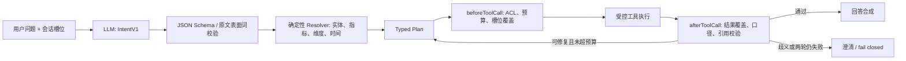

# DMS AI Agent 架构演进

> 状态：2026-08-12 开始落地；本文区分“本轮已实现”和“后续迁移”，不把路线图写成现状。
>
> 参考：[earendil-works/pi](https://github.com/earendil-works/pi) `9795d602306ef68a97585909e8e79f92a389057b`（2026-08-12 最新远端），重点核对
> `packages/agent/src/{types.ts,agent-loop.ts}`。DMS 只借鉴受控 Agent 循环的职责边界，不复制编码 Agent 的工具集和运行时。
> 相比此前审查基线，`packages/agent` 核心未变化；最新提交只涉及 coding-agent 单次运行主题选择，
> 因此本轮不为“追新版本”重造框架，而是补齐 DMS 自身的单一语义入口与执行证据闭环。

## 1. 根问题

当前准确性问题并不只是某几个词没识别，而是用户约束没有成为全链路共享、不可静默丢失的事实：

1. 分诊、追问改写、确定性模板、实体解析和 LLM SQL 各自从字符串重新猜意图。
2. “指标仍相同”曾足以放行改写，地区、商品、时间和分组可以被删除。
3. SQL 安全闸能证明语句只读、字段存在、权限已注入，却不能证明 SQL 回答的是原问题。
4. 确定性路由命中后会被标为可信，但命中路由不等于实体和筛选已完整覆盖。

因此核心不变量改为：

> 用户问题先解析成结构化意图；后续路由、工具、SQL、知识检索和回答都必须携带同一份意图，并在执行前后证明约束覆盖。任何无法证明的约束都应澄清或明确失败，不能静默扩大查询范围。

## 2. 目标链路



模型负责理解“用户说了什么”和在受控范围内规划；事实绑定、权限、SQL 编译、知识检索、覆盖验证和预算由确定性代码负责。

## 3. 唯一语义状态

### 3.1 已实现：`IntentV1`

`crates/agent/src/intent.rs` 使用配置的 Fast 模型（例如 DeepSeek）抽取：

- `mode`：data / knowledge / hybrid / unknown
- `goals`、`metrics`
- `entity_mentions`：保留完整原文表面词和实体类型提示
- `filters`、`regions`
- `time`：原文、显式起止日、粒度
- `breakdowns`、`comparisons`、`requested_detail`
- `ambiguities`

合同刻意不允许模型输出数据库表名、列名、编码或 canonical ID。模型输出只表示用户表达，不能凭空制造事实绑定。JSON 非法、字段越界、超时或模型失败都会留下日志；语义缓存和自由 SQL 路径当轮关闭，避免把“没有有效合同”误当成“用户没有限定”。已有确定性路径仍可尝试，但只能标记为 `review`；需要补充条件时直接返回澄清结果，不能再回落到自由 SQL。

本轮同时启用两道执行性约束：

1. 追问/失败问法的 LLM 改写必须保留实体、地区、时间、筛选和分组；丢槽就放弃改写。
2. 确定性路径和 LLM SQL 在权限闸、数据库执行之前检查指标、实体、地区、时间、筛选、分组、比较、明细形态与歧义；SQL 证据只采纳主查询 `WHERE` 和 `INNER/SEMI JOIN ON`，并绑定真实字面值与列族。首轮缺槽进入既有 repair，第二轮仍缺则 fail closed。

### 3.2 已落地：`PreparedQuestion` 与结构化意图投影

服务入口必须先完成追问消解、日期继承和错字归一，再生成一次 `PreparedQuestion`。Web 同步、
Web 流式、小程序、MCP 与深度报告都消费这同一份生效问句和意图，不再先用原始碎片做
`triage` / `hybrid_split`。显式“问数/知识库”只覆盖执行模式，不重新理解用户条件。

混合问题生成 typed data / knowledge 子目标；全局地区和时间只投影到 Data，唯一且明确共享的
父实体才会投影到各子目标。多实体归属、省略主语或父子槽位冲突无法可靠证明时直接澄清，
两路执行次数均为 0。更精细的 `entity_refs` 归属合同列入下一阶段。

`AskResult.intent_summary` 只透出 mode、用户表面槽位、grounding/coverage 状态和问题码；不含
prompt、SQL、内部实体 ID 或数据库值。前端用它展示“系统理解了什么”，评测用它做语义金标。

### 3.3 目标形态：完整 `ResolvedIntent`

模型不得自行完成实体绑定。下一阶段由注册表和小范围数据探针生成：

```text
ResolvedIntent {
  source,
  metrics: [MetricId],
  entities: [{ surface, kind, canonical_key, confidence, evidence }],
  filters: [ResolvedFilter],
  time: ResolvedTimeRange,
  breakdowns: [DimensionId],
  comparisons,
  ambiguities
}
```

每个绑定保留原文 `surface`、解析证据和置信状态。零命中、多命中或访问受限都必须进入歧义列表，不能选择“看起来最像”的值继续查。

## 4. 受控工具，而不是任意执行权

首批工具固定为：

| 工具 | 输入 | 输出 | 禁止事项 |
|---|---|---|---|
| `resolve_entity` | 原文实体、源、类型提示 | 唯一绑定或歧义候选 | 不返回越权实体 |
| `query_sales` | `sales_fact::QuerySpec` | 行集 + 实际谓词 + 口径 | 不接收任意 SQL |
| `query_inventory` | 商品绑定、仓库/状态筛选 | 库存结果 + 实际谓词 | 商品未唯一解析时不查全量 |
| `search_knowledge` | 查询、空间、ACL、版本策略 | 稳定排序的引用块 | 文档文本不得变成系统指令 |
| `lookup_document` | 文档 ID、章节/页 | 受 ACL 约束的原文 | 不允许裸路径读取 |

旧的自由 SQL 路径暂作为未覆盖领域的 legacy fallback，但必须通过 Intent Coverage、SQL 安全、行权限、口径和结果覆盖五道闸，且不能因为 route 是 deterministic 就自动获得 `verified`。

## 5. 从 pi 借鉴的边界

| pi 机制 | DMS 对应设计 | 采用方式 |
|---|---|---|
| `AgentTool` schema | Rust `serde` 类型 + JSON Schema | 参数验证失败绝不执行工具 |
| `beforeToolCall` | ACL、能力、槽位覆盖、行数/扫描/超时预算 | 拒绝结果是结构化问题，可进入最多两轮修复 |
| `afterToolCall` | 实际谓词、结果口径、引用和覆盖复核 | 工具成功不等于回答可发布 |
| 显式 agent loop | `Intent -> Resolve -> Plan -> Tools -> Verify -> Answer` | 单一循环，禁止再造平行编排器 |
| `AgentEvent` | `intent.parsed/resolved`、`plan.created`、`tool.start/end`、`coverage.failed`、`repair`、`answer`、`abort` | 追加到现有 PG 会话/trace，不引入 JSONL 会话系统 |
| `transformContext` | 只压缩自然语言历史 | `ResolvedIntent`、实体绑定、最近计划和覆盖报告永不被摘要丢弃 |
| `AbortSignal` | Rust cancellation token 贯穿模型、实体探针、SQL 和 KB 检索 | 已实现前端逐轮 abort 与 KB SSE 断流中止 worker；数据 SQL/实体解析的全链路取消继续迁移 |
| `shouldStopAfterTurn` / `prepareNextTurn` | 最大 repair=2、最大工具数、超时/行数/扫描预算 | 无无限自主循环 |

明确不采用：编码 Agent 的 bash/read/write/edit 工具、任意 SQL 工具、默认并行全部调用、无限循环、四字符一 token 的英文压缩阈值，以及另建 JSONL 分支会话。

## 6. 迁移顺序

### P0：结构化理解与止损（本轮已落地）

- 配置模型抽取 `IntentV1`。
- LLM 改写不允许删除显式槽位。
- 模型补造的执行槽位会被原文 grounding 拒绝；意图不可用时关闭缓存与自由 SQL。
- 确定性路径与 LLM SQL 执行前做 AST 级覆盖检查，缺槽最多修一次，再失败则阻断。
- 澄清结果与数据结果分型，澄清不会再被覆盖闸拒掉后回落到自由 SQL。
- 销售周报的省区约束和库存商品约束进入确定性谓词，主查询、明细和比较共用。
- 前端停止/注销/超时会 abort 当前问答；KB SSE 客户端断开会中止后台生成并阻止后续落账。

### P1：解析与工具类型化（本轮已完成第一切片）

- 已引入 `PreparedQuestion`、typed evidence 与意图摘要；Web、流式、小程序、MCP、深度主查询入口一次理解、执行复用。
- 销售与库存的确定性路径开始产出 typed evidence；复杂实体自由 SQL 仍要求后续统一 Resolver，不以 SQL 字串自证。
- `verified` 已增加 `intent_coverage=pass` 硬条件；比较和明细只按实际成功结果计入终态收据。
- 混合问题按 Data/Knowledge 子计划分别验覆盖；多实体省略主语当前 fail closed，后续以 `entity_refs` 精确表达所有权。

### P2：有限 Agent loop（后续）

- 增加 `Plan`、`PlannedToolCall`、`before/after` hooks 和结构化事件。
- 默认顺序执行；只有无依赖的 data + KB 或多个独立子查询按 DAG 并行。
- repair、工具数、总时长、结果行数和扫描量都有硬预算。

### P3：会话与退旧（后续）

- 上一轮结构化意图持久化；追问只继承用户没有显式覆盖的槽。
- 把当前已覆盖的前端与 KB SSE 取消继续透传到数据 SQL、实体探针和所有模型调用。
- 按领域把 `direct.rs`、entity、compound 中重复的字符串解析迁入 resolver/tool adapter；迁完一域删除一域旧规则。

## 7. 必须长期保留的验收

1. `小虎黑椒味烤肠500G的库存信息`：实体唯一解析；主查询和明细都含商品谓词，未知或歧义商品不得退化成全商品 SUM。
2. `山东省 2026-08-10 至 2026-08-11 销售额`：指标、地区和日期逐槽覆盖；主查询、明细、环比与补充指标共享地区谓词。
3. 随机删除实体、时间、筛选或分组的改写/SQL 必须被 verifier 拒绝；“指标仍相同”不能放行。
4. `美的烤箱，保修期多久，库存多少`：两个子计划都继承“美的烤箱”，并分别通过覆盖校验。
5. 多轮 `本月山东销售额` → `那江苏呢`：只替换地区；显式说“今年”时覆盖旧时间。
6. unsupported / ambiguous 100% fail closed；零 silent broadening；未通过覆盖的结果永不标记 `verified`。
7. 评测由 route/SQL 子串升级为 `Intent gold + fixture 结果等价 + CoverageReport`；路由可以演进，答案语义不能漂移。

## 8. 可观测指标

- Intent JSON 合约成功率、模型失败/超时率。
- 每类槽位的丢失率和 repair 成功率。
- unresolved / ambiguous 比例与澄清后成功率。
- `coverage.failed` 按 route、模型和工具分布。
- 相同问题在同一知识快照下的检索序列、引用集合和答案指纹稳定率。
- 取消后仍发生的模型调用、SQL、消息落账数量，目标为 0。

这些指标比“命中了哪个 route”更接近用户真正关心的正确性，也能区分模型理解失败、实体绑定失败、计划丢槽、SQL 编译错误和知识版本冲突。
## 9. V2 复合问题合同

系统执行链以一份经原问 grounding 的结构化意图为唯一语义状态：

`PreparedQuestion → ResolvedIntent → typed subgoal → entity resolver → governed execution → result verification → receipt/UI`

### 子任务归属

新意图协议使用 `version: 2`。每个 `subgoal` 是完整的小意图，独立携带实体、指标、筛选、地区、时间、分组、比较和明细要求。共享条件必须在每个相关子任务中显式重复，并用 `evidence_surfaces` 记录位于子句外的共享原文；根级执行槽位必须为空。服务端不再根据“槽位在整句出现过”猜归属。旧协议仅为历史兼容，归属无法唯一证明时必须澄清。

模型只抽取用户写过的表面事实，不能生成数据库表列、编码或 canonical ID。`ResolvedIntent` 内层私有，只能由 grounding/validation 构造；投影到子任务后再次校验，任何丢槽、补槽、歧义或路由漂移都终止执行。

### 可信结果

“SQL 执行成功”不等于“答案可信”。结果终闸还会验证：

- 结果行数与 wire shape 一致；
- 请求指标存在真实、可解析的执行值；
- 同比/环比实际执行且 current 与主 KPI 一致；
- 明细、地区、时间、实体等必需槽位完成覆盖；
- 知识答案具有可追溯引用，冲突信息不自动替用户选边。

验证失败仍可在安全场景展示已有结果，但收据必须是 `blocked/review`，不得标记为 verified。

### 参考系统取舍

- 借鉴 DataFoundry 的 requirement/assertion/verified-value 不变量；
- 借鉴 pi 的 typed tool、before/after hook、取消和事件收据；
- 借鉴 Yuxi 的知识库 list/find/open 与可见范围解析；
- 不引入通用 ReAct、任意 SQL/代码工具、LangGraph 或无限自主循环。企业 BI 的模型负责理解和规划，确定性代码负责解析、权限、执行与验收。

### 下一边界

客户实体已统一走 canonical resolver。商品仍区分 DMS 商品主档与 WMS SKU 两个事实源，只有在各自唯一键和映射合同明确后才能统一；禁止仅按名称把两套实体合并。

## 10. 已验证事实与结果收据

本轮已将 DataFoundry 的 verified-value 不变量收口为一套 Rust
`AnswerContract`，并复用 pi `afterToolCall` 的责任边界：工具返回不等于结果可发布，
必须先经过服务端终验。

- `VerifiedFact` 按 namespace、主体、指标、值、单位与证据编号绑定；不同行、主体、子问、数据/知识来源不得借值。
- AI 解读中的数值、日期、倍数、中文数字和“最高/下降/禁止/必须”等定性断言都必须有同作用域事实；不可证就丢弃 AI 文案，保留原始取数结果。
- 深度报告 KPI 同时绑定已 grounding 的主体、完整指标和精确数值；“山东销售额”不能换成“江苏销售额”或“净销售额”。
- `/api/analysis` 不再信任客户端回传的行、比较或补充表；问数响应对分析素材签发与登录人/角色绑定的 HMAC 收据，任一字段改动都拒绝。保存报告再校验结论收据。
- `query_log` / trace 以 verification/coverage/trust 决定 succeeded 或 blocked，UI 先展示可信边界和问题码，再展示 AI 结论。

### DMS 权威口径

行政省份不等于门店业务省区。语义目录已登记
`dms_ods.t_shop_province_department_mapping` 和 `t_master_shop.province_department_name`的有效映射合同；
例如上海执行到浙江省区、海南执行到广东省区。`customer.department_id`
不再被当作门店省区依据。这些映射进入确定性 SQL 谓词和金文件，不只是 prompt 提示。
